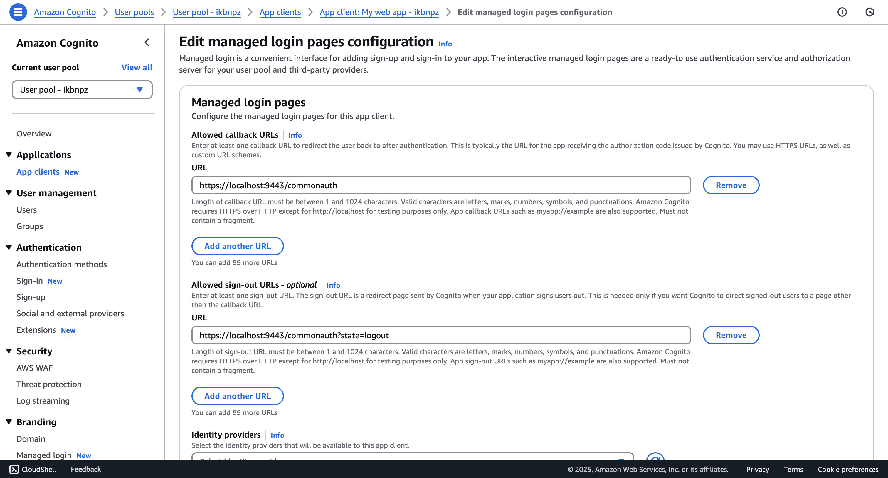
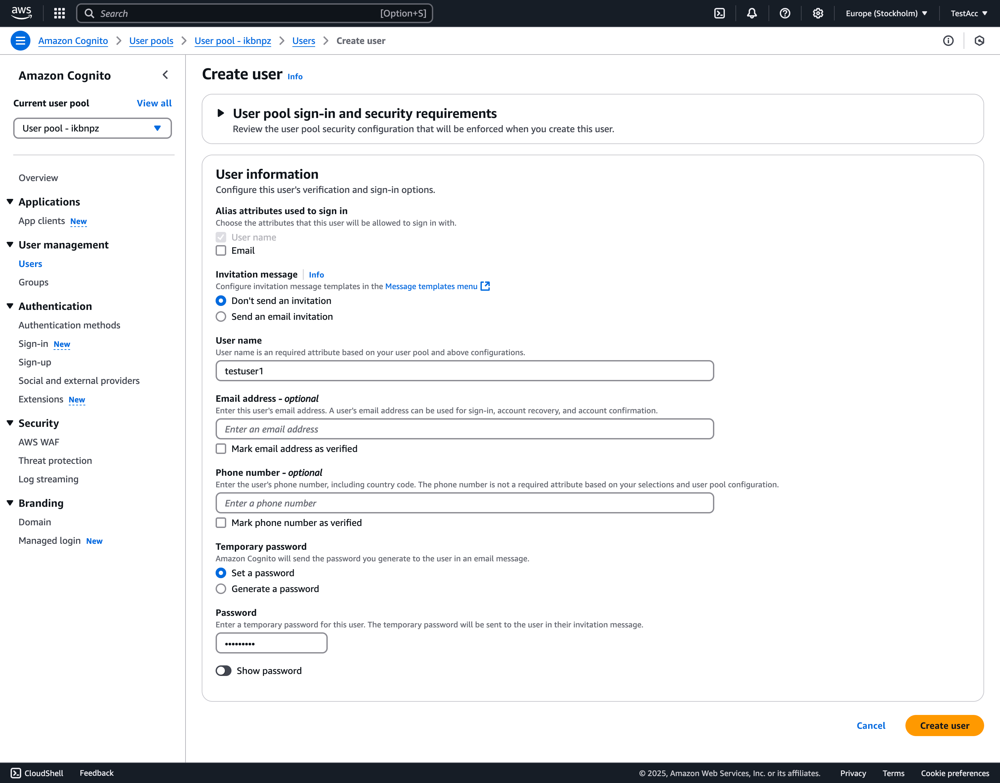
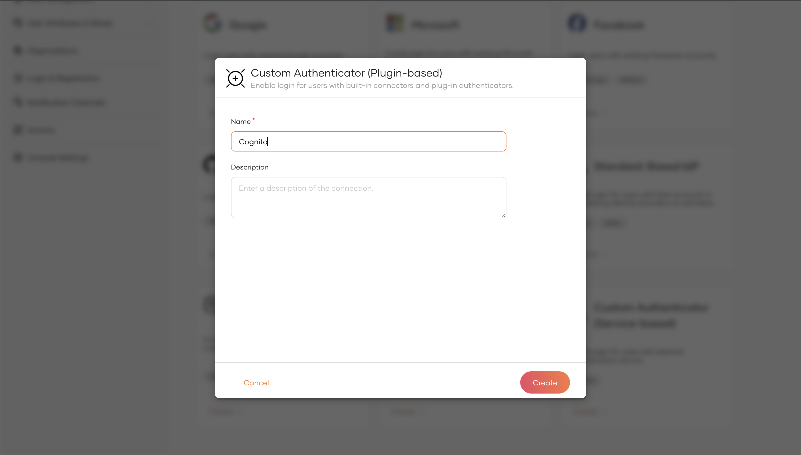
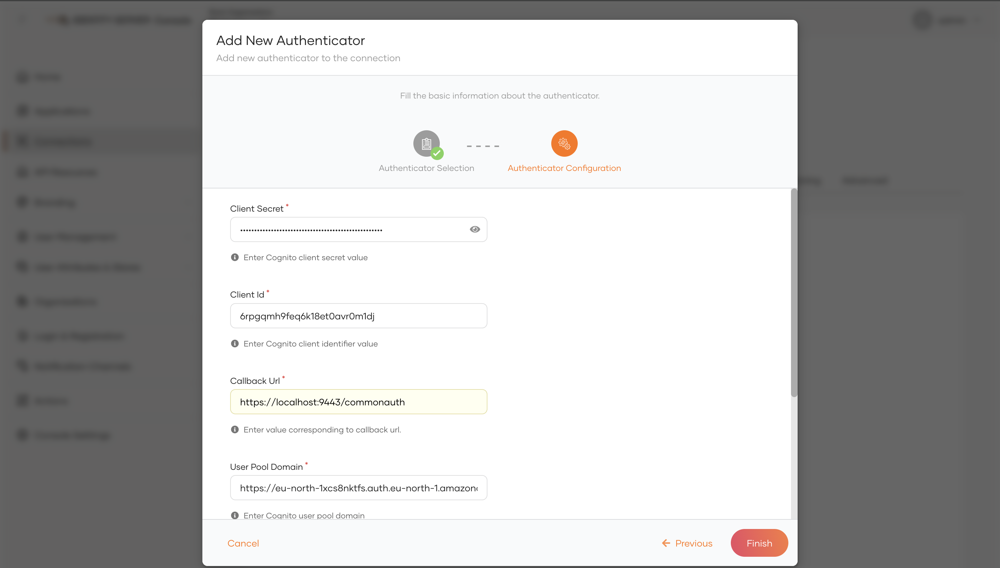
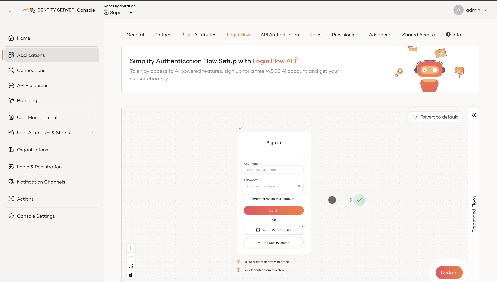

# AWS Cognito Authenticator

The AWS Cognito Authenticator allows users to log in to your organization's applications using [AWS Cognito](https://docs.aws.amazon.com/cognito/index.html), which is a distributed version control and source code management service. The AWS Cognito authenticator is configured as a federated authenticator in WSO2 Identity Server 5.7.0 and above. 
The AWS Cognito Authenticator also supports federated single logout with the AWS Cognito. 

Let's explore the following topics to learn how to configure the AWS Cognito authenticator and WSO2 Identity Server. 

* [Deploying AWS Cognito Authenticator artifacts](#Deploying-AWS-Cognito-authenticator-artifacts)

* [Configuring the AWS Cognito user pool](#Configuring-the-AWS-Cognito-user-pool)

* [Configuring the identity provider](#configuring-the-identity-provider)

* [Configuring the service provider](#Configuring-the-Service-Provider)

* [Try out the login flow with Cognito test user](#try-out-the-login-flow-with-cognito-test-user)
``

## Compatibility 

| Version  | Supported WSO2 IS versions |
| ------------- | ------------- |
| 1.0.0| above 5.7.0    |

## Deploying AWS Cognito authenticator artifacts
You can either download the AWS Cognito authenticator artifacts or build the authenticator from the source code. 

1. To download the AWS Cognito artifacts: 
    1. Stop WSO2 Identity Server if it is already running.
    2. Visit the [Connector Store](https://store.wso2.com/connector/identity-outbound-auth-cognito) and download the artifacts.
    3. Copy the `org.wso2.carbon.identity.application.authenticator.cognito-x.x.x.jar` file into the `<IS-Home>/repository/components/dropins` directory.
    
2. To build from the source code:
    1. Stop WSO2 Identity Server if it is already running.
    2. To build the authenticator, navigate to the `identity-outbound-auth-cognito` directory and execute the following command in a command prompt.
       ```
       mvn clean install
       ```
       Note that the `org.wso2.carbon.identity.application.authenticator.cognito-x.x.x.jar` file is created in the `identity-outbound-auth-cognito/component/target` directory.
    3. Copy the `org.wso2.carbon.identity.application.authenticator.cognito-x.x.x.jar` file into the `<IS-Home>/repository/components/dropins` directory. 

### Additional Configuration for AWS Cognito Authenticator

To enable the AWS Cognito Authenticator, you need to add the following configurations in the `IS_HOME/repository/conf/identity/application-authentication.xml` file or the `deployment.toml` file, depending on the version of WSO2 Identity Server you are using.

#### For WSO2 Identity Server with `deployment.toml` Support

Add the following configuration to the `IS_HOME/repository/conf/deployment.toml` file:

```toml
[authentication.authenticator.cognito]
name = "CognitoOIDCAuthenticator"
enable = true
[authentication.authenticator.cognito.parameters]
ClaimDialectUri = "http://wso2.org/oidc/claim"
CognitoAuthzEndpoint = "/oauth2/authorize"
CognitoTokenEndpoint = "/oauth2/token"
CognitoUserInfoEndpoint = "/oauth2/userInfo"
CognitoLogoutEndpoint = "/logout"
```

#### For WSO2 Identity Server Without `deployment.toml` Support

Add the following configuration to the `IS_HOME/repository/conf/identity/application-authentication.xml` file:

```xml
<AuthenticatorConfig name="CognitoOIDCAuthenticator" enabled="true">
  <Parameter name="ClaimDialectUri">http://wso2.org/oidc/claim</Parameter>
  <Parameter name="CognitoAuthzEndpoint">/oauth2/authorize</Parameter>
  <Parameter name="CognitoTokenEndpoint">/oauth2/token</Parameter>
  <Parameter name="CognitoUserInfoEndpoint">/oauth2/userInfo</Parameter>
  <Parameter name="CognitoLogoutEndpoint">/logout</Parameter>
</AuthenticatorConfig>
``` 

Note : These configurations are hardcoded in the Authenticator. If the configurations are not present these will taken as default

## Configuring the AWS Cognito user pool

Follow the steps below to configure an user pool in AWS Cognito.

1. Sign in to [AWS Console](https://console.aws.amazon.com/console/home).
2. Search for Amazon Cognito and click on it service.
3. Click on **User Pools** and create a new user pool.
  

  - Select **Traditional web application** as the application type.
  - Provide a name for your application.
  - Choose **Email** and **Username** as the sign-in identifiers.
  - Choose **email**, **family_name**, and **given_name** as the required attributes for sign-up.
  - Add the return URL as the commonauth endpoint:
    `https://<IS_HOST>:<IS_PORT>/t/<TENANT_DOMAIN>/commonauth`
4. On the **Set up resources for your application** page, click the **Go to overview** button.  
5. In the left-side panel, under the **Applications** section, select **App clients**.  
    
6. Note down the **Client ID** and **Client secret** from the app client details.  
7. Under **App clients**, navigate to the **Login Pages** tab, click **Edit**, and add the following sign-out URL:  
  `https://<IS_HOST>:<IS_PORT>/t/<TENANT_DOMAIN>/commonauth?state=logout`  
  Save the changes.  
    

  > **Note:** The query parameter `state=logout` is mandatory in the sign-out URL.  

8. In the left-side panel, under **User Management**, select **Users** and create a test user for sign-in testing.  
    
9. Navigate to the **Domain** section under **Branding** and note down the Cognito domain.

## Configuring the identity provider

An identity provider (IdP) is responsible for authenticating users and issuing identification information by using security tokens like SAML 2.0, OpenID Connect, OAuth 2.0 and WS-Trust.

### Configuring the identity provider (IS 7.0.0 Onwards)

> **Note:** This section is applicable only if you are using an Identity Server version below 7.0.0.

Follow the steps below to configure WSO2 Identity Server as an IdP that uses AWS Cognito for federated authentication. 

> **Before you begin**
> 1. [Download](http://wso2.com/products/identity-server/) WSO2 Identity Server.
> 2. [Run](https://is.docs.wso2.com/en/latest/deploy/get-started/run-the-product/) WSO2 Identity Server.

1. Access the WSO2 Identity Server [Management Console](https://is.docs.wso2.com/en/latest/deploy/get-started/run-the-product/#access-the-wso2-identity-server-console) as an administrator.
2. Go to **Connections** and select **New Connection**. From the available templates, choose **Custom Authenticator (Plugin-based)**. Enter a name for the connection (e.g., Cognito) and click **Create**.  
  
4. On the connection edit page, navigate to the **Settings** tab. Click **New Authenticator**, select **CognitoOIDCAuthenticator**, and then click **Next**.

5. Provide the following details for the fields:

  - **Client Id**: Enter the client ID copied from the Cognito console.
  - **Client Secret**: Enter the client secret copied from the Cognito console.
  - **Callback URL**: `https://<IS_HOST>:<IS_PORT>/t/<TENANT_DOMAIN>/commonauth`
  - **User Pool Domain**: Enter the domain copied from the Cognito console.
  - **Logout Redirect URL**: `https://<IS_HOST>:<IS_PORT>/t/<TENANT_DOMAIN>/commonauth?state=logout`

  

6. Click **Finish**.

### Configuring the identity provider (Below IS 7.0.0)

> **Note:** This section is applicable only if you are using an Identity Server version above 7.0.0.

Follow the steps below to configure WSO2 Identity Server as an IdP that uses AWS Cognito for federated authentication. 

> **Before you begin**
> 1. [Download](http://wso2.com/products/identity-server/) WSO2 Identity Server.
> 2. [Run](https://docs.wso2.com/display/IS570/Running+the+Product) WSO2 Identity Server.

1. Access the WSO2 Identity Server [Management Console](https://docs.wso2.com/display/IS570/Getting+Started+with+the+Management+Console) as an administrator.
2. Navigate to **Main > Identity > Identity Providers** and click **Add**.
  

3. Enter a suitable name for the identity provider in the **Identity Provider Name** text box.

4. Under **Federated Authenticators**, click **AWS Cognito Configuration** and enter the required values as given below. 

    <table class="tg">
      <tr>
        <th class="tg-c3ow" align="center">Field</th>
        <th class="tg-0pky" align="center">Description</th>
        <th class="tg-0pky" align="center">Sample Value</th>
      </tr>
      <tr>
        <td class="tg-0pky"><b>Enable</b></td>
        <td class="tg-0pky">Selecting this option enables AWS Cognito to be used as an authenticator for users provisioned to WSO2 Identity Server.</td>
        <td class="tg-0pky">Selected</td>
      </tr>
      <tr>
        <td class="tg-0pky"><b>Default</b></td>
        <td class="tg-0pky">Selecting this option signifies that AWS Cognito is used as the main/default form of authentication. Selecting this removes the selection made for any other Default checkboxes for other authenticators.</td>
        <td class="tg-0pky">Selected</td>
      </tr>
      <tr>
        <td class="tg-0pky"><b>Client Id</b></td>
        <td class="tg-0pky">This is the <code>client key</code> of your AWS Cognito user pool.</td>
        <td class="tg-0pky"><code>1uttd7h38ccaelctoklpdid60b</code></td>
      </tr>
      <tr>
        <td class="tg-0pky"><b>Client Secret</b></td>
        <td class="tg-0pky">This is the <code>client secret</code> of your AWS Cognito user pool.</td>
        <td class="tg-0pky"><code>12cicbu0uc1i72krvtcqvq1n6hk6qbtib6i1i376hfcmm2t9cljq</code></td>
      </tr>
      <tr>
        <td class="tg-0pky"><b>Callback URL</b></td>
        <td class="tg-0pky">This is the service provider's URL to which <code>authorization codes</code> are sent upon successful authentication, the browser should be redirected to this URL. This should be same as the value specified in the User pool App client setting</td>
        <td class="tg-0pky"><code>https://www.wso2is.com:9443/commonauth</code></td>
      </tr>
      <tr>
        <td class="tg-0pky"><b>User Pool Domain</b></td>
        <td class="tg-0pky">This is the <code>User Pool Domain</code> of your AWS Cognito user pool.</td>
        <td class="tg-0pky"><code>https://wso2iscognito.auth.us-east-1.amazoncognito.com</code></td>
      </tr>
      <tr>
        <td class="tg-0pky"><b>Logout Redirect URL</b></td>
        <td class="tg-0pky">This is the service provider's URL to which the log out response are sent updon the logout response from AWS Cognito, the browser should be redirected to this URL. This should be same as the value specified in the User pool App client setting.  It is mandatory to have the state=logout added as the query parameter</td>
        <td class="tg-0pky"><code>https://www.wso2is.com:9443/commonauth?state=logout</code></td>
      </tr>
    </table>

    

5. Click **Register**. 

## Configuring the service provider

### Configuring the service provider (IS 7.0.0 Onwards)

> **Note:** This section is applicable only if you are using an Identity Server version above 7.0.0.

1. Navigate to the **Applications** section and click **New Application** to create an application of your choice for testing login functionality using OIDC, SAML, or WS-Trust protocols.
2. Open the **Login Flow** tab of the newly created application. Click **Add Sign In Option** and select the **Cognito** connection as the sign-in option for the first step.
  

### Configuring the service provider (Below IS 7.0.0)

> **Note:** This section is applicable only if you are using an Identity Server version below 7.0.0.

- In the 'Local & Outbound Authentication Configuration' of the service provider add the created identity provider as federated authenticator

## Try out the login flow with Cognito test user

Once you have completed the configuration of the identity provider and service provider, you can test the login flow using the Cognito test user created earlier.

1. Navigate to the application you configured in WSO2 Identity Server.
2. Click on the login button or access the login URL of the application.
3. On the WSO2 Identity Server login page, select the **Cognito** sign-in option.
4. You will be redirected to the Cognito login page.
5. Enter the credentials of the test user you created in the AWS Cognito user pool and click **Sign In**.
6. Upon successful authentication, you will be redirected back to the application with the authenticated session.

> **Note:** If you encounter any issues during the login process, verify the configurations in both AWS Cognito and WSO2 Identity Server to ensure they are correct.
