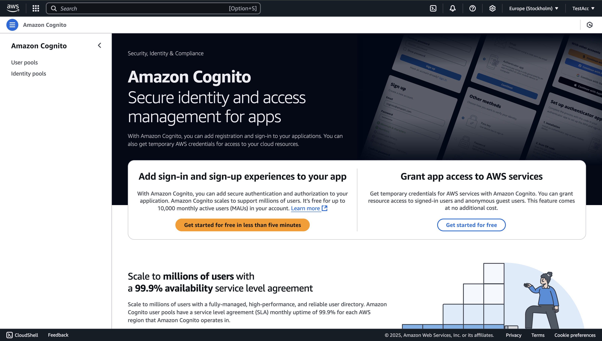
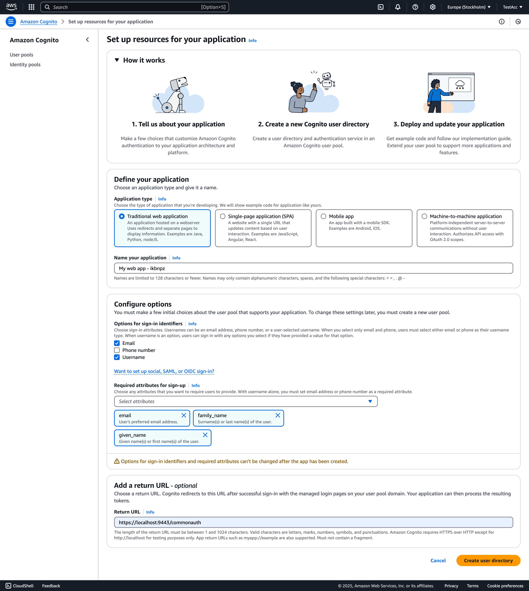
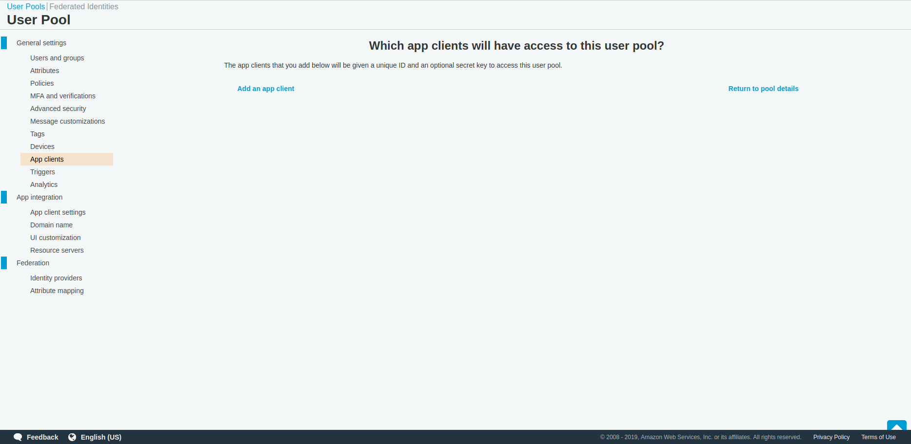
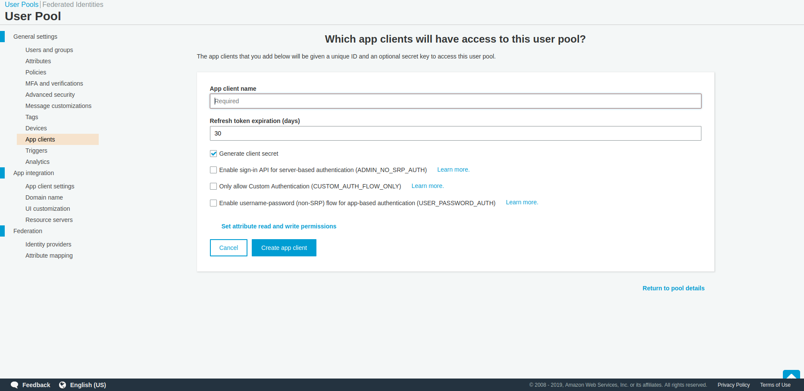
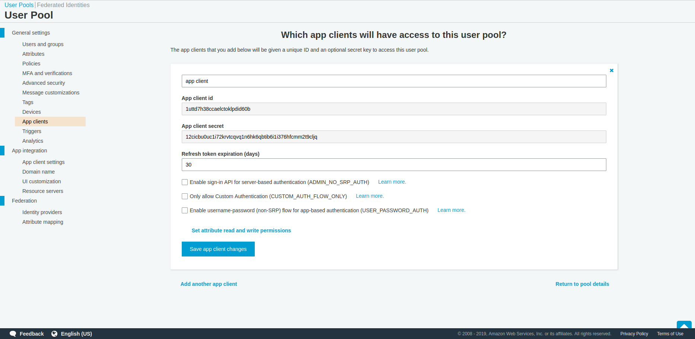
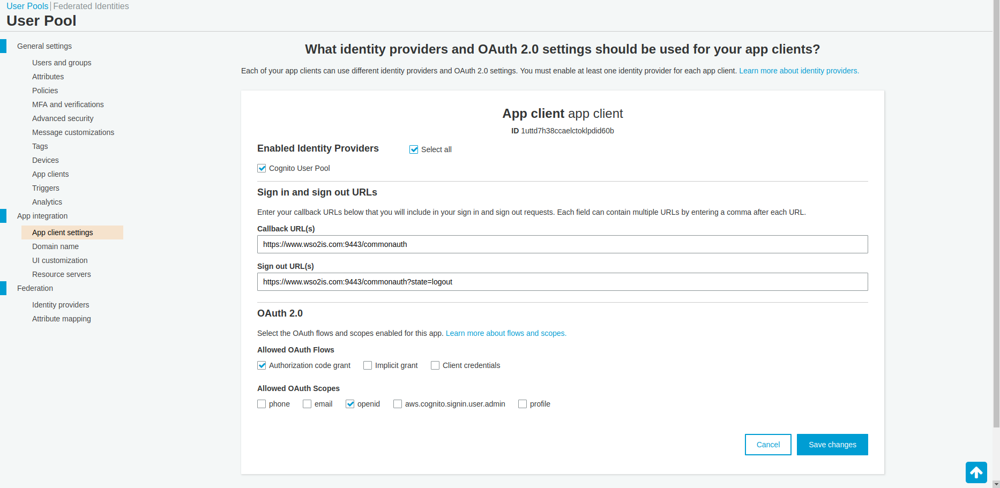
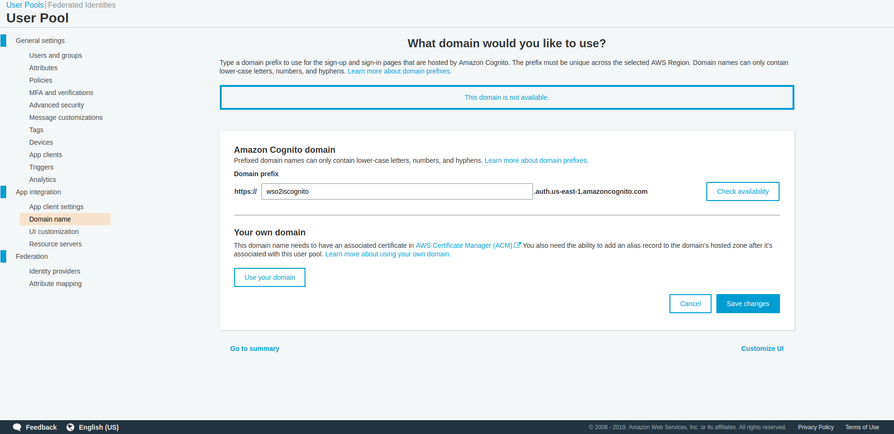
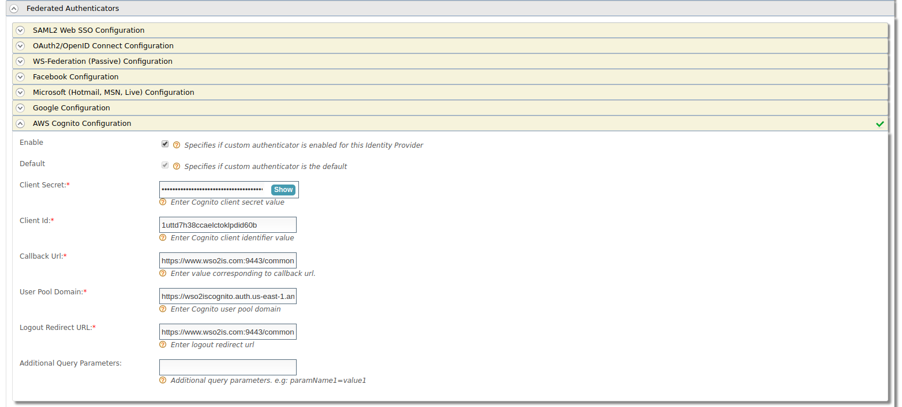

# AWS Cognito Authenticator

The AWS Cognito Authenticator allows users to log in to your organization's applications using [AWS Cognito](https://docs.aws.amazon.com/cognito/index.html), which is a distributed version control and source code management service. The AWS Cognito authenticator is configured as a federated authenticator in WSO2 Identity Server 5.6.0 and above. 
The AWS Cognito Authenticator also supports federated single logout with the AWS Cognito. 

Let's explore the following topics to learn how to configure the AWS Cognito authenticator and WSO2 Identity Server. 

* [Deploying AWS Cognito Authenticator artifacts](#Deploying-AWS-Cognito-authenticator-artifacts)

* [Configuring the AWS Cognito user pool](#Configuring-the-AWS-Cognito-user-pool)

* [Configuring the identity provider](#Configuring-the-Identity-Provider)

* [Configuring the service provider](#Configuring-the-Service-Provider)
``

## Compatibility 

| Version  | Supported WSO2 IS versions |
| ------------- | ------------- |
| 1.0.0| above 5.6.0    |

## Deploying AWS Cognito authenticator artifacts
You can either download the AWS Cognito authenticator artifacts or build the authenticator from the source code. 

1. To download the AWS Cognito artifacts: 
    1. Stop WSO2 Identity Server if it is already running.
    2. Visit the [Connector Store]() and download the artifacts.
    3. Copy the `org.wso2.carbon.identity.application.authenticator.cognito-x.x.x.jar` file into the `<IS-Home>/repository/components/dropins` directory.
    
2. To build from the source code:
    1. Stop WSO2 Identity Server if it is already running.
    2. To build the authenticator, navigate to the `identity-outbound-auth-cognito` directory and execute the following command in a command prompt.
       ```
       mvn clean install
       ```
       Note that the `org.wso2.carbon.identity.application.authenticator.cognito-x.x.x.jar` file is created in the `identity-outbound-auth-cognito/component/target` directory.
    3. Copy the `org.wso2.carbon.identity.application.authenticator.cognito-x.x.x.jar` file into the `<IS-Home>/repository/components/dropins` directory. 

- Add the following configuration in IS_HOME/repository/conf/identity/application-authentication.xml
        
        <AuthenticatorConfig name="CognitoOIDCAuthenticator" enabled="true">
            <Parameter name="ClaimDialectUri">http://wso2.org/oidc/claim</Parameter>
            <Parameter name="CognitoAuthzEndpoint">/oauth2/authorize</Parameter>
            <Parameter name="CognitoTokenEndpoint">/oauth2/token</Parameter>
            <Parameter name="CognitoUserInfoEndpoint">/oauth2/userInfo</Parameter>
            <Parameter name="CognitoLogoutEndpoint">/logout</Parameter>
        </AuthenticatorConfig>
        

Note : These configurations are hardcoded in the Authenticator. If the configurations are not present these will taken as default

## Configuring the AWS Cognito user pool

Follow the steps below to configure an user pool in AWS Cognito.

1. Sign in to [AWS Console](https://console.aws.amazon.com/console/home).
2. Search for Amazon Cognito and click on it service.
    
3. Click on 'Manage User Pools' and then create a User Pool
    
    Provide a 'Pool name' and  'Review Default'. Then review the setting and click on 'Create'. After that the user pool will be created
4. In the General setting, click on App clients.
    
5. Click 'App client' and provide 'App client name'. Then click on 'Create app client'
    
6. The App client details will be prompted. Take a note of the 'App client id' and 'App client secret'
    
7. In the App client setting of the App integration of the user pool provide the following
    - Enabled Identity Providers : Cognito User Pool 
    - Callback URL(s) : https://<is_host>:<is_port>/commonauth
    - Sign out URL(s) : https://<is_host>:<is_port>/commonauth?state=logout
    - Allowed OAuth Flows  : Authorization code grant
    - Allowed OAuth Scopes  : openid
      
  Note : It is mandatory to have the state=logout added as the query parameter of the sign out url

  
8. Set up the Domain name for the User Pool. You can specify 'Amazon Cognito domain' or use your own domain
  
9. In 'Users and Groups' create user.


## Configuring the identity provider

An identity provider (IdP) is responsible for authenticating users and issuing identification information by using security tokens like SAML 2.0, OpenID Connect, OAuth 2.0 and WS-Trust.

Follow the steps below to configure WSO2 Identity Server as an IdP that uses AWS Cognito for federated authentication. 

> **Before you begin**
> 1. [Download](http://wso2.com/products/identity-server/) WSO2 Identity Server.
> 2. [Run](https://docs.wso2.com/display/IS570/Running+the+Product) WSO2 Identity Server.

1. Access the WSO2 Identity Server [Management Console](https://docs.wso2.com/display/IS570/Getting+Started+with+the+Management+Console) as an administrator.
2. Navigate to **Main > Identity > Identity Providers** and click **Add**.
  

3. Enter a suitable name for the identity provider in the **Identity Provider Name** text box.

4. Under **Federated Authenticators**, click **AWS Cognito Configuration** and enter the required values as given below. 

    <table class="tg">
      <tr>
        <th class="tg-c3ow" align="center">Field</th>
        <th class="tg-0pky" align="center">Description</th>
        <th class="tg-0pky" align="center">Sample Value</th>
      </tr>
      <tr>
        <td class="tg-0pky"><b>Enable</b></td>
        <td class="tg-0pky">Selecting this option enables AWS Cognito to be used as an authenticator for users provisioned to WSO2 Identity Server.</td>
        <td class="tg-0pky">Selected</td>
      </tr>
      <tr>
        <td class="tg-0pky"><b>Default</b></td>
        <td class="tg-0pky">Selecting this option signifies that AWS Cognito is used as the main/default form of authentication. Selecting this removes the selection made for any other Default checkboxes for other authenticators.</td>
        <td class="tg-0pky">Selected</td>
      </tr>
      <tr>
        <td class="tg-0pky"><b>Client Id</b></td>
        <td class="tg-0pky">This is the <code>client key</code> of your AWS Cognito user pool.</td>
        <td class="tg-0pky"><code>1uttd7h38ccaelctoklpdid60b</code></td>
      </tr>
      <tr>
        <td class="tg-0pky"><b>Client Secret</b></td>
        <td class="tg-0pky">This is the <code>client secret</code> of your AWS Cognito user pool.</td>
        <td class="tg-0pky"><code>12cicbu0uc1i72krvtcqvq1n6hk6qbtib6i1i376hfcmm2t9cljq</code></td>
      </tr>
      <tr>
        <td class="tg-0pky"><b>Callback URL</b></td>
        <td class="tg-0pky">This is the service provider's URL to which <code>authorization codes</code> are sent upon successful authentication, the browser should be redirected to this URL. This should be same as the value specified in the User pool App client setting</td>
        <td class="tg-0pky"><code>https://www.wso2is.com:9443/commonauth</code></td>
      </tr>
      <tr>
        <td class="tg-0pky"><b>User Pool Domain</b></td>
        <td class="tg-0pky">This is the <code>User Pool Domain</code> of your AWS Cognito user pool.</td>
        <td class="tg-0pky"><code>https://wso2iscognito.auth.us-east-1.amazoncognito.com</code></td>
      </tr>
      <tr>
        <td class="tg-0pky"><b>Logout Redirect URL</b></td>
        <td class="tg-0pky">This is the service provider's URL to which the log out response are sent updon the logout response from AWS Cognito, the browser should be redirected to this URL. This should be same as the value specified in the User pool App client setting.  It is mandatory to have the state=logout added as the query parameter</td>
        <td class="tg-0pky"><code>https://www.wso2is.com:9443/commonauth?state=logout</code></td>
      </tr>
    </table>

    

5. Click **Register**. 

You have successfully added the identity provider. Next, you will configure the service provider. 

## Configuring the service provider
- In the 'Local & Outbound Authentication Configuration' of the service provider add the created identity provider as federated authenticator
